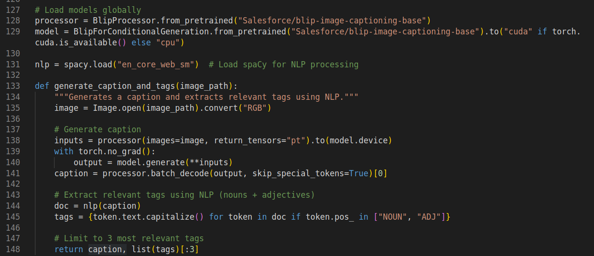
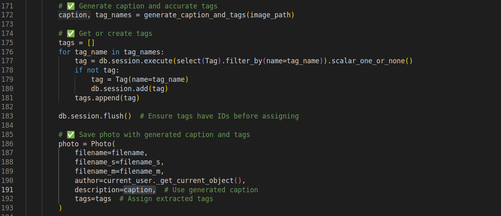
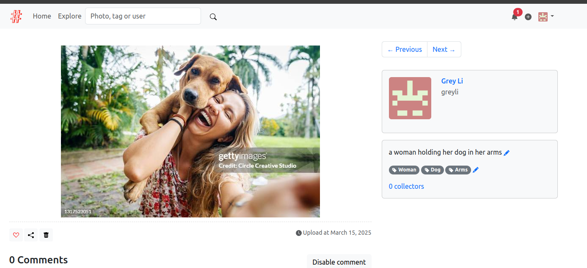
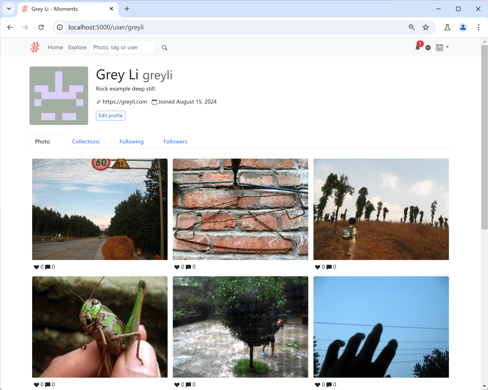

# Implementation by Fabricio Crespo

## Commands used to deploy docker with kafka:

- Modified files: 

  `./moments/blueprints/main.py` : We had to add an extra functionality to get the image, process it with a image captioning model from transforms, identify the most relevant workds in the caption using npl (from spacy library) and the return the description and the tags.

## Results

- Extra functionality to implement ML models to get description and tags in the file `./moments/blueprints/main.py` :



- The changes to put description and tags to each uploaded image:



- Final result where we can see the description and tags is not empty anymore. They are infered by ML models.




# Moments

A photo sharing social networking app built with Python and Flask. The example application for the book *[Python Web Development with Flask (2nd edition)](https://helloflask.com/en/book/4)* (《[Flask Web 开发实战（第 2 版）](https://helloflask.com/book/4)》).

Demo: http://moments.helloflask.com



## Installation

Clone the repo:

```
$ git clone https://github.com/greyli/moments
$ cd moments
```

Install dependencies with [PDM](https://pdm.fming.dev):

```
$ pdm install
```

> [!TIP]
> If you don't have PDM installed, you can create a virtual environment with `venv` and install dependencies with `pip install -r requirements.txt`.

To initialize the app, run the `flask init-app` command:

```
$ pdm run flask init-app
```

If you just want to try it out, generate fake data with `flask lorem` command then run the app:

```
$ pdm run flask lorem
```

It will create a test account:

* email: `admin@helloflask.com`
* password: `moments`

Now you can run the app:

```
$ pdm run flask run
* Running on http://127.0.0.1:5000/
```

## License

This project is licensed under the MIT License (see the
[LICENSE](LICENSE) file for details).
